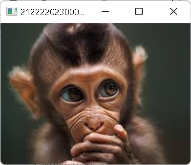
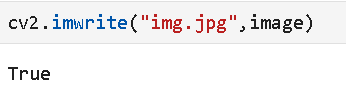
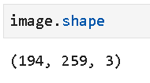
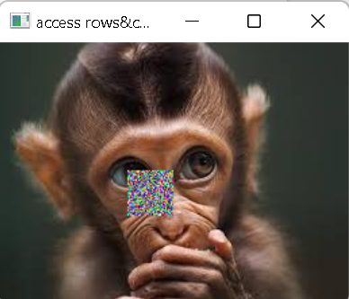
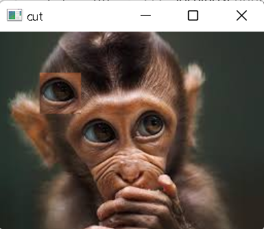

# READ AND WRITE AN IMAGE

## AIM:
To write a python program using OpenCV to do the following image manipulations. 
<br/>i) Read and display the image
<br/>ii) Write the image
<br/>iii) Shape of the Image
<br/>iv) Access rows and columns
<br/>v) Cut and paste portion of image

## SOFTWARE REQUIRED:
Anaconda - Python 3.7

## ALGORITHM:
### Step 1: 
Choose an image and save it as image.jpg
### Step 2:
Use imread(image, flags) to read the file.
### Step 3:
Use imshow(window_name, image) to display the image.
### Step 4:
Use imwrite(filename, image) to write the image.
### Step 5:
End the program and close the output image windows.
## PROGRAM:
```
# Developed By: Y Chethan 
# Register Number: 212220230008
# To Read,display the image

import cv2
image=cv2.imread(r"C:\Users\Y Chethan\Downloads\images.jpg",1)
cv2.imshow("21220230008_monkey",image)
cv2.waitKey(0)

# To write the image

cv2.imwrite("img.jpg",image)

# Find the shape of the Image

image.shape

# To access rows and columns

import random
column=image.shape[1]
row=image.shape[0]
image=cv2.imread(r"C:\Users\Y Chethan\Downloads\images.jpg",1)
for i in range(95,130):
    for j in range(95,129):
        image[i][j]=[random.randint(0,255),random.randint(0,255),random.randint(0,255)]
cv2.imshow("access rows&cols",image)
cv2.waitKey(0)

# To cut and paste portion of image

image=cv2.imread(r"C:\Users\Y Chethan\Downloads\images.jpg",1)
cut=image[80:120,80:120]
image[40:80,40:80]=cut
cv2.imshow("cut",image)
cv2.waitKey(0)
```

## OUTPUT:
### i) Read and display the image

### ii)Write the image

### iii)Shape of the Image

### iv)Access rows and columns

### v)Cut and paste portion of image

## RESULT:
Thus the images are read, displayed, and written successfully using the python program.
