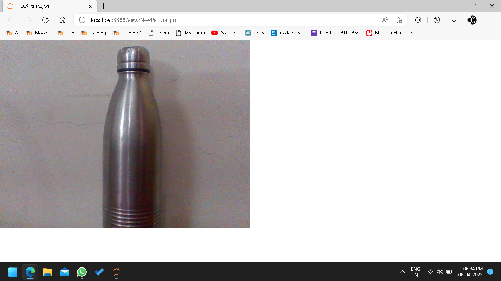
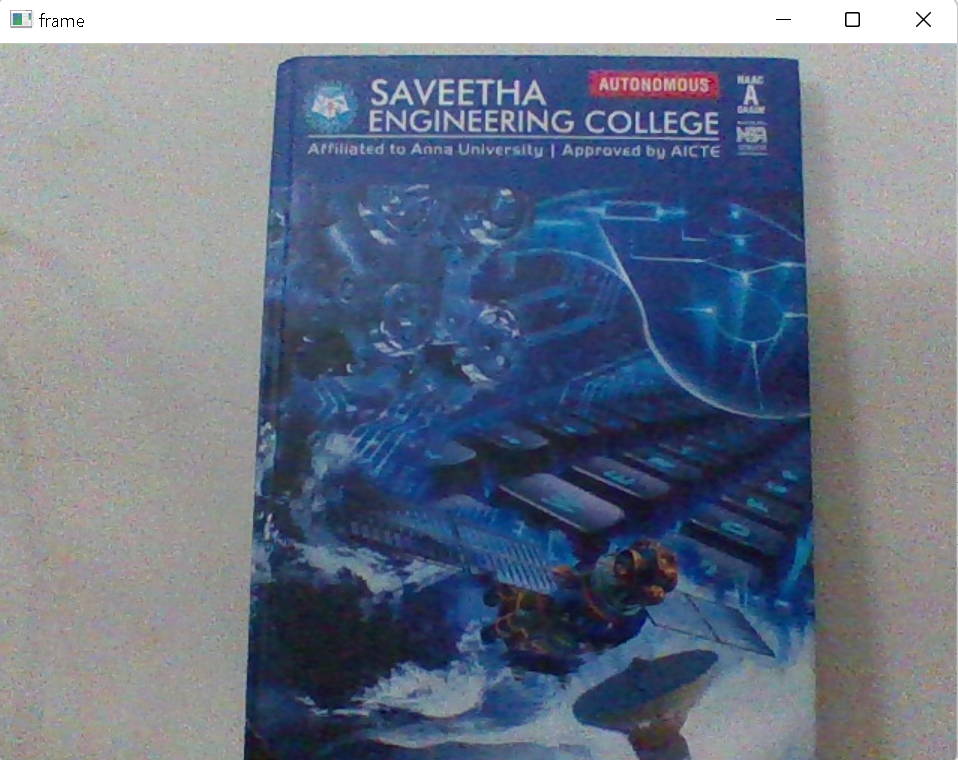
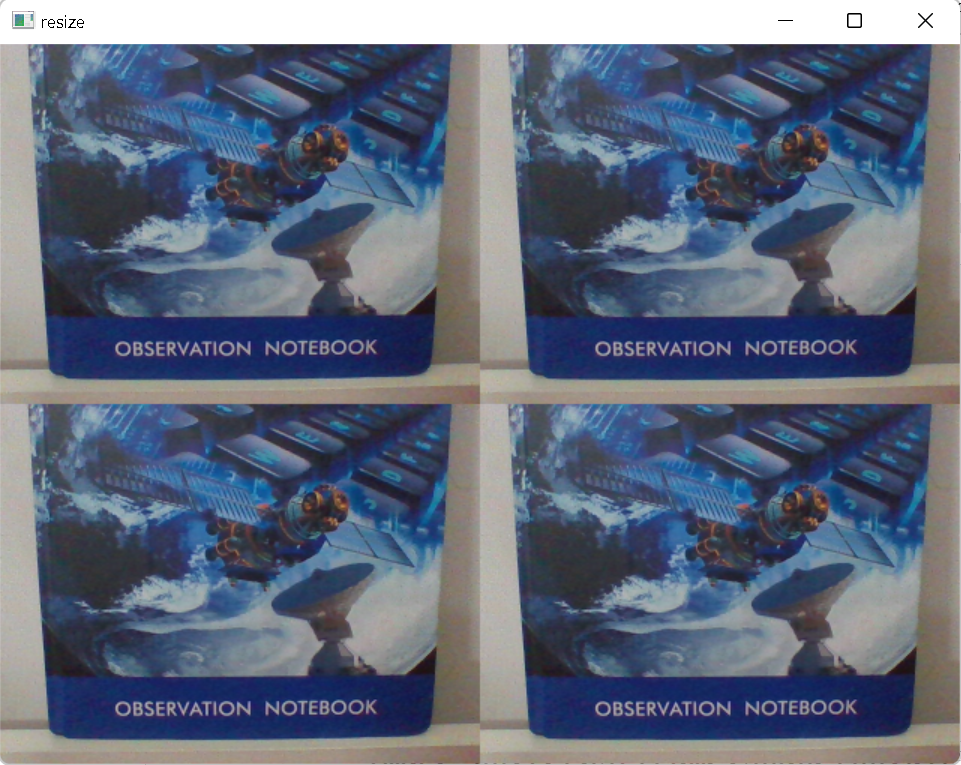
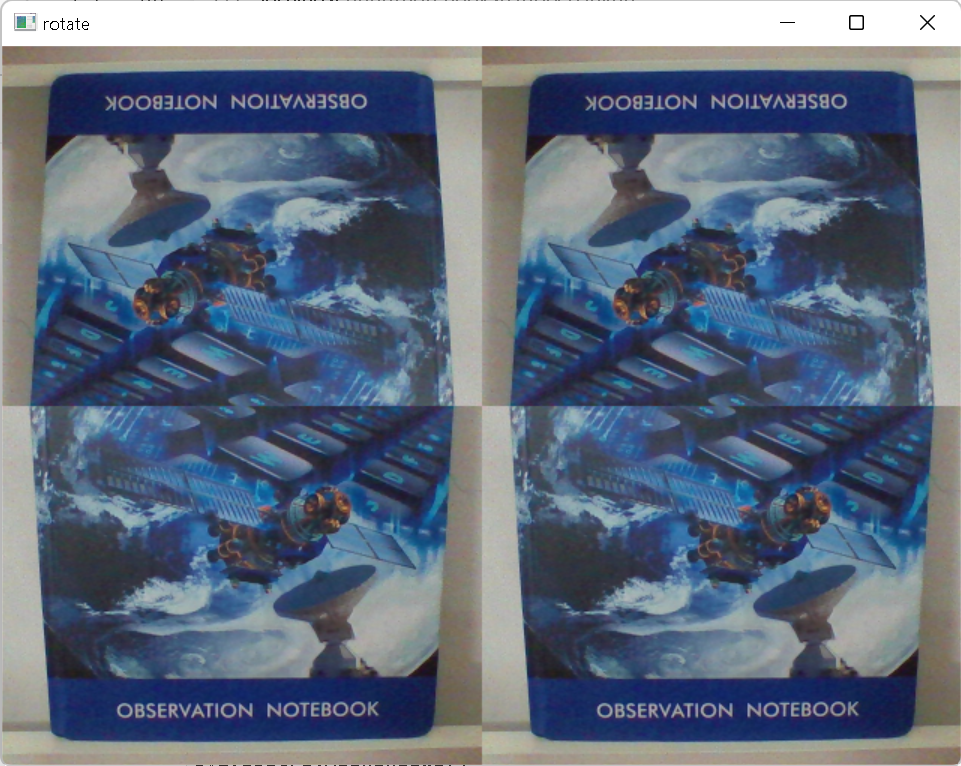

# Image-Acquisition-from-Web-Camera

## AIM:

To write a python program using OpenCV to capture the image from the web camera and do the following image manipulations.
<br/>i) Write the frame as JPG
<br/>ii) Display the video
<br/>iii) Display the video by resizing the window
<br/>iv) Rotate and display the video

## SOFTWARE REQUIRED:

Anaconda - Python 3.7

## ALGORITHM:

### Step 1:
Use image=cv2.VideoCapture(0) to capture the frame using webcamera and use imwrite(filename, image) to write the image.
### Step 2:
To display the video use<br/>cv2.imshow(window_name, frame)<br/>&ensp;&ensp;&ensp;&ensp;&ensp;if cv2.waitKey(1) == ord('q')<br/>&ensp;&ensp;&ensp;&ensp;&ensp;&ensp;&ensp;break
### Step 3:
To display the video by resizing the window size use cv2.resize(src, dsize, fx, fy, interpolation)
### Step 4:
To rotate and display the video use cv2.cv2.rotate( src, rotateCode[, dst] )
### Step 5:
End the program and close the output image windows.

## PROGRAM:
```
### Developed By: Y Chethan
### Register No: 212220230008

## i) Write the frame as JPG file

import cv2
image = cv2.VideoCapture(0)
while(True):
    ret,frame = image.read()
    cv2.imwrite("NewPicture.jpg",frame)
    result = False
image.release()

## ii) Display the video

cap=cv2.VideoCapture(0)
while True:
    ret,frame=cap.read()
    cv2.imshow('frame', frame)
    if cv2.waitKey(1) == ord('q'):
        break
cap.release()
cv2.destroyAllWindows()

## iii) Display the video by resizing the window

import numpy as np
cap=cv2.VideoCapture(0)
while True:
    ret,frame=cap.read()
    width=frame.shape[1]
    height=frame.shape[0]
    image=np.zeros(frame.shape,np.uint8)
    smaller_frame=cv2.resize(frame,(0,0),fx=0.5,fy=0.5)
    image[:height//2, :width//2] =smaller_frame
    image[:height//2,width//2:]=smaller_frame
    image[height//2:,width//2:]=smaller_frame
    image[height//2:,:width//2]=smaller_frame
    cv2.imshow('resize', image)
    if cv2.waitKey(1) == ord('q'):
        break
cap.release()
cv2.destroyAllWindows()

## iv) Rotate and display the video

cap=cv2.VideoCapture(0)
while True:
    ret,frame=cap.read()
    width=frame.shape[1]
    height=frame.shape[0]
    image=np.zeros(frame.shape,np.uint8)
    smaller_frame=cv2.resize(frame,(0,0),fx=0.5,fy=0.5)
    image[:height//2, :width//2] =cv2.rotate(smaller_frame,cv2.cv2.ROTATE_180)
    image[:height//2,width//2:]=cv2.rotate(smaller_frame,cv2.cv2.ROTATE_180)
    image[height//2:,width//2:]=smaller_frame
    image[height//2:,:width//2]=smaller_frame
    cv2.imshow('rotate', image)
    if cv2.waitKey(1) == ord('q'):
        break
cap.release()
cv2.destroyAllWindows()

```
## OUTPUT:

### i) Write the frame as JPG image


### ii) Display the video

### iii) Display the video by resizing the window

### iv) Rotate and display the video


## RESULT:
Thus, the image is accessed from webcamera and displayed using openCV.
